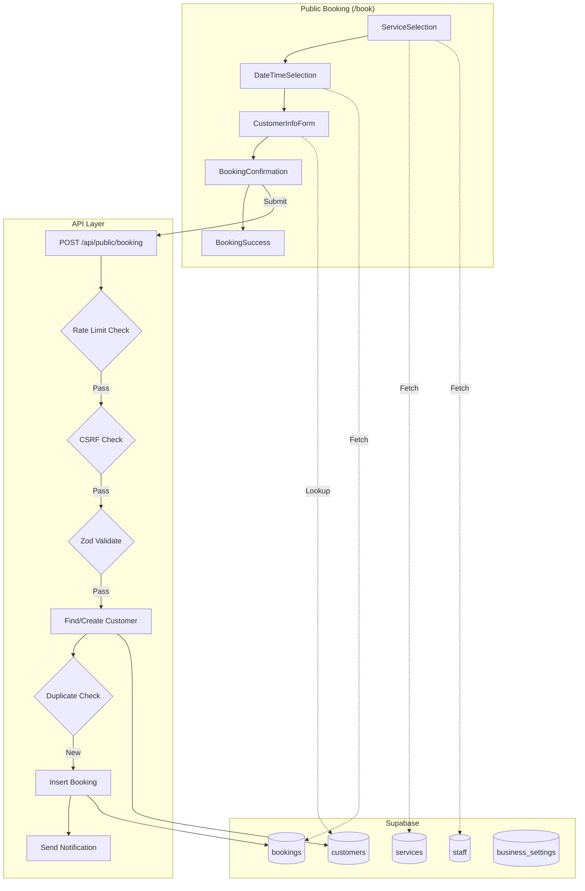

# Insight: HMS Salon — Booking System Architecture & Improvement Map

**Date**: 2026-03-15
**Project**: HMS Salon
**Type**: Architecture

## Current System

### Booking Flow (4 Steps)
```
Service Selection → Date/Time → Customer Info → Confirm → Success
```

### Components (6 files)
```
src/app/book/
├── page.tsx                       # Main orchestrator (407 lines)
├── layout.tsx                     # Layout wrapper
└── components/
    ├── ServiceSelection.tsx       # Service cards + category filter + staff picker
    ├── DateTimeSelection.tsx      # Calendar + time slots (30-min intervals)
    ├── CustomerInfoForm.tsx       # Phone lookup + name + notes
    ├── BookingConfirmation.tsx     # Summary card with pricing + T&C
    ├── BookingSuccess.tsx          # Success + WhatsApp + Waze/Maps + ICS calendar
    └── BookingSteps.tsx            # Step indicator
```

### API Route
```
src/app/api/public/booking/route.ts
```
- Zod validation (customerName, customerPhone, serviceId, staffId, date, time)
- CSRF protection (origin/referer check)
- Rate limiting (5 req / 15 min per IP)
- Auto-create customer if phone not found (handles race condition on duplicate)
- Duplicate booking detection (same customer + date + time)
- Supabase service role (bypasses RLS for public access)
- Non-blocking notification via NotificationService

### Utilities
```
src/lib/utils/booking-utils.ts
```
- `ALL_TIME_SLOTS`: 09:00-20:30, 30-min intervals, break 13:00-14:00
- `generateCalendarDays()`: Calendar grid with past-date disable
- `calculateEndTime()`: Duration-based end time
- `getWhatsAppLink()`: Pre-filled WhatsApp message

### Database Tables Involved
- `services` (id, name, category, price, duration, promo_price, promo_active, image_url)
- `staff` (id, name, role, is_active)
- `bookings` (id, customer_id, service_id, staff_id, booking_date, start_time, end_time, status, notes)
- `customers` (id, name, phone, tier, points_balance)
- `business_settings` (setting_key='business_info' → name, phone, whatsapp, address)

## Key Features Already Built
1. **Category filter** — horizontal scroll pills
2. **Staff selection** — optional, defaults to "Sesiapa"
3. **Promo pricing** — shows original price struck-through + discount %
4. **Service images** — from Supabase, fallback to Scissors icon
5. **Conflict detection** — checks existing bookings per date, respects staff filter
6. **Existing customer lookup** — debounced phone check, auto-fills name, shows tier badge
7. **WhatsApp deep link** — pre-filled booking details
8. **ICS calendar download** — .ics file generation on success
9. **Waze + Google Maps links** — on success page
10. **Malay locale** — date-fns `ms` locale, full Malay UI

## Security Hardening
- Zod schema validation on all inputs
- CSRF origin check
- Rate limiting (IP-based, 5 per 15 min)
- Service role key (not anon) — no RLS bypass risk
- Duplicate booking guard
- Race condition handling on customer creation (unique constraint catch)

## Potential Improvement Areas

### UX
- Multiple service selection (combo booking)
- Operating hours configurable from dashboard (currently hardcoded in ALL_TIME_SLOTS)
- Holiday/off-day calendar (block specific dates)
- Booking status tracking page (customer checks own booking via phone/ID)
- Staff availability per day (not all staff work every day)

### Business Logic
- Deposit/payment integration (online payment before confirm)
- Auto-confirm vs manual confirm toggle
- Cancellation policy (time-based, e.g., 24hr before)
- Waitlist when fully booked
- Recurring booking (weekly/monthly same service)

### Notifications
- WhatsApp auto-send (Fonnte — currently skipped)
- Reminder notification (1 day before, 2 hours before)
- Admin dashboard notification (new booking alert)

### Performance
- No SSR on booking page (fully client-side) — consider partial server components
- No caching on services/staff data — could use SWR/React Query
- Calendar re-renders on every state change

## Architecture Diagram



## Key Decisions

| Decision | Why | Alternative Considered |
|----------|-----|----------------------|
| Client-side only (no SSR) | Public page, SEO not critical for booking form | SSR with server components |
| Service role key | Public users can't authenticate, need RLS bypass | Anon key + permissive RLS policies |
| 30-min slot intervals | Salon services vary 30-120min, 30min is granular enough | 15-min intervals |
| Phone-based customer lookup | Simplest identifier, no account needed | Email-based or OTP verification |
| Pending status default | Owner wants to manually confirm bookings | Auto-confirm |
| Break 13:00-14:00 hardcoded | Simple for now, single salon | Configurable from dashboard |

---
*Generated: 2026-03-15 | Commit: `afc8bd8` (latest) | 15 commits since booking page built*
